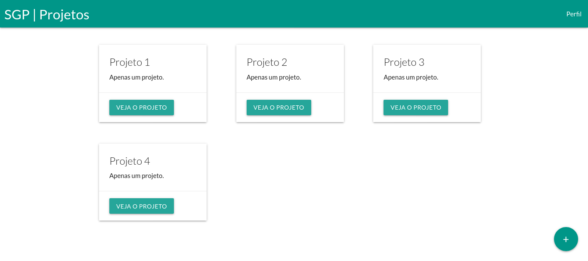

# SGP - Sistema de Gestão de Projetos

<p align="center">
  
</p>

<p align="center">
  <a href="https://forthebadge.com">  </a>
  <a href="https://forthebadge.com">  </a>
  <a href="https://forthebadge.com">  </a>
</p>

## :scroll: Sobre
Sistema de Gestão de Projetos.

Funcionalidades:
* Criar Conta
* Logar
* Deslogar
* Cadastrar/Adicionar Projeto (Coordenador/Pesquisador)
* Adicionar Aluno em um Projeto (Coordenador/Pesquisador)
* Adicionar Tarefa em um Projeto (Coordenador/Pesquisador)
* Editar Projeto (Coordenador/Pesquisador)
* Deletar Projeto (Coordenador/Pesquisador)
* Ver Projeto
* Ver Perfil
* Central de Aprovações (Coordenador)

---


## :rocket: Tecnologias utilizadas
* HTML
* CSS
* JavaScript
* Firebase (Banco de Dados)

---


## :computer: Como baixar e configurar o projeto
```bash
  // Clonar o repositório
  $ git clone https://github.com/jjoaovitor7/GestaoDeProjetos

  // Entrar no diretório
  $ cd GestaoDeProjetos

  // Criar um Projeto no Firebase (https://console.firebase.google.com/).
  // Criar um Banco de Dados Cloud Firestore (no Firebase).
  // Criar um Aplicativo (web) (no Firebase) e ao criar esse aplicativo você terá acesso à:
  // apiKey, authDomain, projectId, storageBucket, messagingSenderId e ao appId.
  // Substituir os campos nos arquivo env.js pelas suas "credenciais". (apiKey, authDomain, entre outros).
```

---
